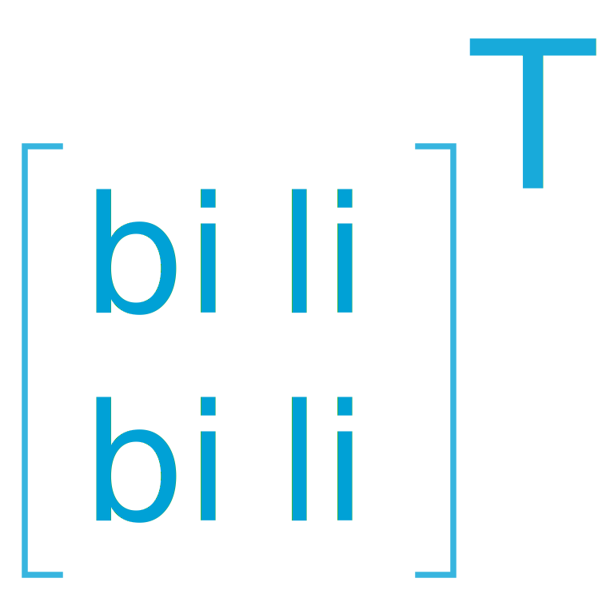

Bibilili is a Chrome Manifest V3 extension for Bilibili watch pages. It transposes the watch layout so comments sit to the right of the player and video lists sit in a bounded dock below it.

  <picture>
    <source media="(prefers-color-scheme: dark)" srcset="assets/bibilili-logo-white.svg">
    
  </picture>

The extension keeps Bilibili in charge of playback, comments, links, and network-backed content while its content script owns the transformed viewport, source toggles, video cards, and layout bookkeeping.
