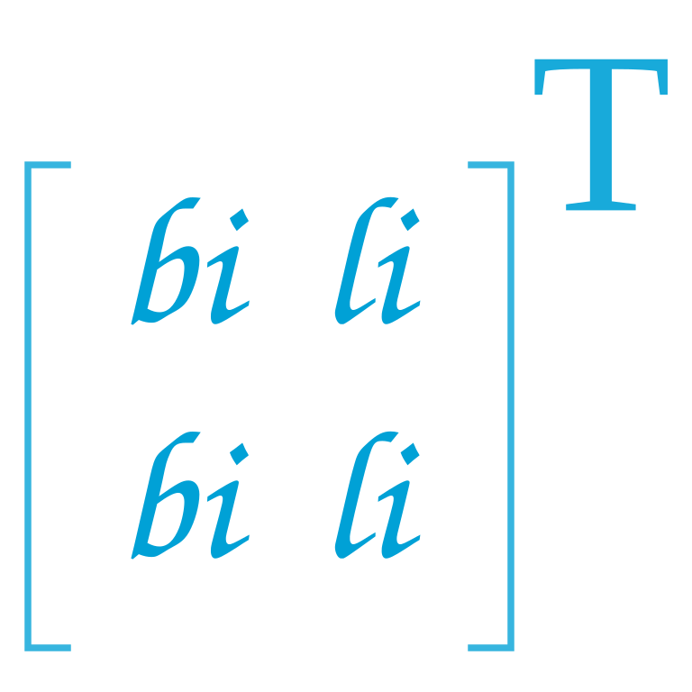

<div align="center">
  <picture>
    <source media="(prefers-color-scheme: dark)" srcset="assets/bibilili-logo-white.svg">
    
  </picture>
</div>
<br>

Bibilili is a Manifest V3 browser extension for Bilibili watch pages. It transposes the watch layout so comments sit to the right of the player and video lists sit in a bounded dock below it.

The extension keeps Bilibili in charge of playback, comments, links, and network-backed content while its content script owns the transformed viewport, source toggles, video cards, and layout bookkeeping.

## Packaging

Bibilili ships from one source tree with browser-specific release packages:

```sh
make package
```

The Chrome package is written to `dist/bibilili-chrome-<version>.zip` with Firefox-only manifest keys removed. The Firefox package is written to `dist/bibilili-firefox-<version>.zip` with Gecko signing metadata retained.
